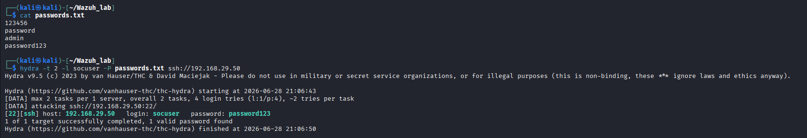
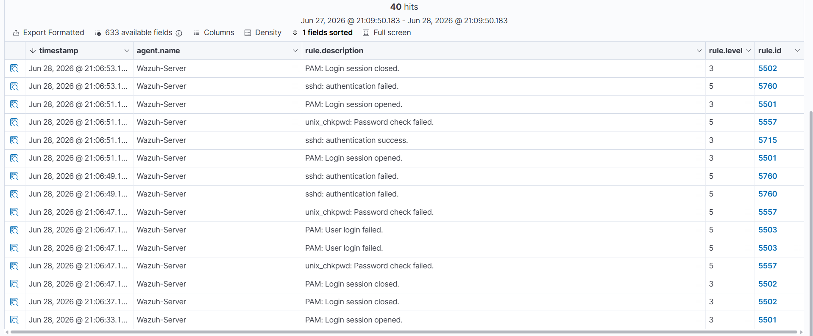
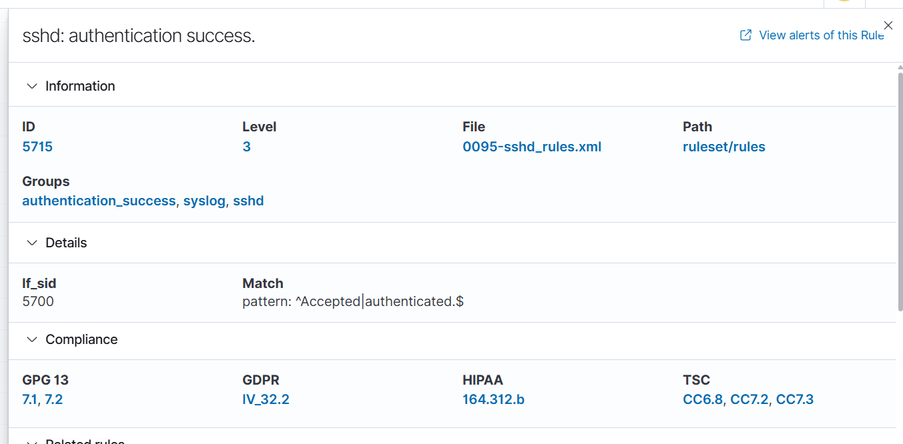
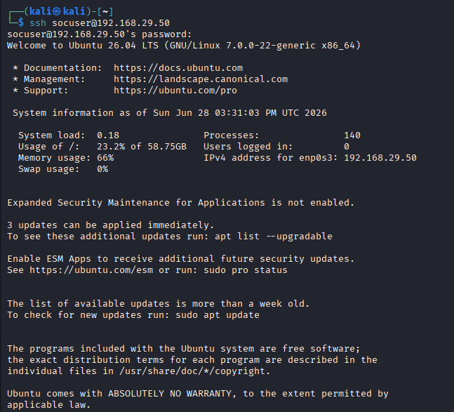

# SSH Brute Force Detection using Wazuh

## Overview

This exercise demonstrates how a Security Information and Event Management (SIEM) platform can detect and monitor SSH brute-force attacks in a controlled Home SOC Lab. A brute-force attack was simulated from a Kali Linux attacker machine against an Ubuntu Server running the Wazuh Manager. The resulting authentication logs were collected, analyzed, and investigated using the Wazuh Dashboard.

This exercise represents a common real-world attack scenario and demonstrates the complete SOC workflow:

**Attack → Detection → Investigation → Mitigation**

---

# Objective

The objective of this exercise was to:

* Simulate an SSH brute-force attack using Hydra.
* Generate authentication events on the target Ubuntu server.
* Monitor and analyze the attack using Wazuh.
* Identify the attacker, targeted account, and authentication results.
* Understand how Wazuh correlates Linux authentication logs into security events.

---

# Lab Environment

| Component        | Details                 |
| ---------------- | ----------------------- |
| Host OS          | Windows 11              |
| Hypervisor       | Oracle VirtualBox       |
| SIEM             | Wazuh 4.12              |
| SIEM Server      | Ubuntu Server 24.04 LTS |
| Attacker Machine | Kali Linux              |
| Attack Tool      | Hydra                   |
| Target Service   | OpenSSH                 |

---

# Network Topology

```
                    Windows Host
                          │
        ┌─────────────────┴─────────────────┐
        │                                   │
        │                                   │
 Ubuntu Server                      Kali Linux
(Wazuh Manager)                  (Attacker Machine)
192.168.29.50                     192.168.29.251
        │                                   │
        └──────────────SSH──────────────────┘
```

---

# Attack Scenario

An attacker attempts to gain unauthorized access to an SSH server by repeatedly guessing the password of a valid user account using Hydra.

The attack targets the user account:

```
socuser
```

---

# Attack Execution

## Verify SSH Connectivity

Before launching the attack, SSH connectivity was verified.

```bash
ssh socuser@192.168.29.50
```

Successful login confirmed that the SSH service was operational.

---

## Password Wordlist

A small custom password list was created for testing purposes.

```text
123456
password
admin
Password123
```

---

## Hydra Command

```bash
hydra -t 2 -l socuser -P passwords.txt ssh://192.168.29.50
```

### Parameters

| Parameter             | Description          |
| --------------------- | -------------------- |
| `-t 2`                | Two parallel threads |
| `-l socuser`          | Username to attack   |
| `-P passwords.txt`    | Password list        |
| `ssh://192.168.29.50` | Target SSH server    |

---

# Detection in Wazuh

The Ubuntu server generated authentication logs which were collected by the Wazuh Manager.

Several authentication-related events appeared within the Wazuh Dashboard.

## Authentication Failed

| Rule ID | Description                        | Level |
| ------- | ---------------------------------- | ----: |
| 5760    | sshd: authentication failed        |     5 |
| 5557    | unix_chkpwd: Password check failed |     5 |
| 5503    | PAM: User login failed             |     5 |

These events indicate unsuccessful authentication attempts generated during password guessing.

---

## Authentication Success

| Rule ID | Description                  | Level |
| ------- | ---------------------------- | ----: |
| 5715    | sshd: authentication success |     3 |

The event indicates that the correct password was eventually accepted.

Example event:

```
Accepted password for socuser from 192.168.29.251 port 61072 ssh2
```

---

# Investigation

## Source IP

```
192.168.29.251
```

Attacker machine running Kali Linux.

---

## Destination IP

```
192.168.29.50
```

Ubuntu Server running Wazuh Manager.

---

## Target User

```
socuser
```

---

## Attack Vector

SSH Password Authentication

---

## Log Evidence

```
Accepted password for socuser from 192.168.29.251 port 61072 ssh2
```

This confirms that authentication was successfully completed after multiple login attempts.

---

# MITRE ATT&CK Mapping

| Tactic            | Technique                      | ID        |
| ----------------- | ------------------------------ | --------- |
| Credential Access | Brute Force: Password Guessing | T1110.001 |

---

# Impact

If performed against a production server, a successful SSH brute-force attack could allow an attacker to:

* Obtain unauthorized server access.
* Escalate privileges.
* Install persistence mechanisms.
* Steal sensitive information.
* Move laterally through the network.

---

# Mitigation

Recommended defensive measures include:

* Disable password-based SSH authentication.
* Use SSH public key authentication.
* Disable remote root login.
* Enforce strong password policies.
* Install Fail2Ban to automatically block repeated failed logins.
* Restrict SSH access using firewall rules.
* Enable Multi-Factor Authentication (MFA) where possible.
* Continuously monitor authentication logs using a SIEM.

---

# Evidence

## Hydra Attack



---

## SSH Authentication Alerts

The Wazuh dashboard generated authentication failure and success events during the brute-force attack.



---

## Successful Authentication Details

This event confirms that the attacker successfully authenticated using the `socuser` account.



---

## SSH Access Verification

SSH access to the Ubuntu server after successful authentication.



---

# Lessons Learned

This exercise demonstrates how Wazuh can successfully detect and record Linux authentication events generated during an SSH brute-force attack. By correlating multiple authentication failures with a successful login, analysts can identify credential attacks, investigate the source of the activity, and begin an incident response process.

Although this attack was performed in a controlled laboratory environment, it closely reflects techniques observed in real-world intrusion attempts and provides practical experience in SOC monitoring, log analysis, and security event investigation.

---

# Skills Demonstrated

* Wazuh SIEM Administration
* Linux System Administration
* SSH Authentication Monitoring
* Hydra Brute Force Simulation
* Log Analysis
* Incident Investigation
* MITRE ATT&CK Mapping
* Threat Hunting
* Security Monitoring
